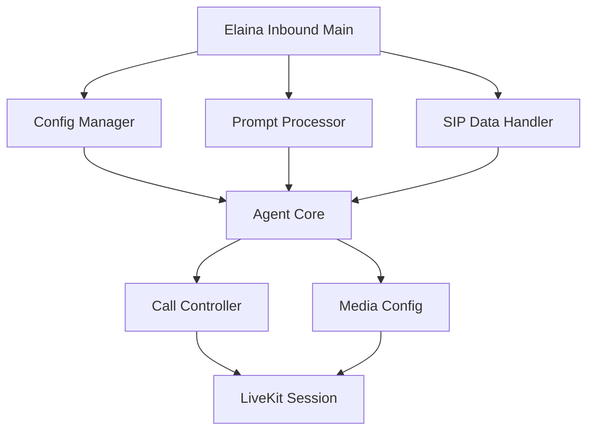

# Улучшенная архитектура для агента Elaina Inbound (LiveKit)

## Обзор

Текущий файл `elaina-inbound-mango.py` содержит слишком много ответственностей в одном модуле. Цель рефакторинга - разделить функциональность на несколько модулей для лучшей читаемости, поддержки и тестирования кода, при этом сохранив LiveKit архитектуру.

## Текущая архитектура

Файл `agent/elaina-inbound-mango.py` включает следующие компоненты:
- Логика агента (InboundAgent)
- Управление конфигурацией и переменными окружения
- Обработка промптов и шаблонов
- Управление вызовами (hangup, transfer, etc.)
- Обработка данных SIP-вызовов
- Настройка параметров STT, TTS, LLM
- Точка входа (entrypoint)

## Новая архитектура

### Модули

1. `agent/modules/agent_core.py` - Основной класс InboundAgent с логикой агента
2. `agent/modules/config_manager.py` - Управление конфигурацией и переменными окружения
3. `agent/modules/prompt_processor.py` - Обработка промптов и шаблонов
4. `agent/modules/call_controller.py` - Управление вызовами (hangup, transfer, etc.)
5. `agent/modules/sip_data_handler.py` - Обработка данных SIP-вызовов
6. `agent/modules/media_config.py` - Настройка параметров STT, TTS, LLM
7. `agent/elaina-inbound-mango.py` - Только точка входа (entrypoint) и инициализация

### Диаграмма архитектуры

## Подробное описание модулей

### 1. agent/modules/agent_core.py
Содержит класс InboundAgent с основной логикой агента:
- Идентификация клиентов по номеру телефона
- Проверка фраз прощания
- Обработка инструментов (transfer_call, end_call, look_up_availability, confirm_appointment, detected_answering_machine)
- Управление участником сессии
- Все методы, связанные с внутренней логикой агента

### 2. agent/modules/config_manager.py
Отвечает за:
- Загрузку и управление переменными окружения
- Загрузку .env файлов
- Обработку конфигурационных параметров
- Управление глобальными настройками агента

### 3. agent/modules/prompt_processor.py
Отвечает за:
- Загрузку шаблона промпта из markdown файла
- Подстановку переменных в промпт
- Обработку системного промпта
- Валидацию и форматирование промптов

### 4. agent/modules/call_controller.py
Отвечает за:
- Управление завершением вызовов
- Передачу вызовов
- Обработку различных сценариев завершения вызова
- Состояния вызовов

### 5. agent/modules/sip_data_handler.py
Отвечает за:
- Обработку SIP-данных
- Извлечение информации о звонящем
- Работу с метаданными SIP-вызовов
- Определение номера телефона из различных источников

### 6. agent/modules/media_config.py
Отвечает за:
- Настройку параметров STT (Speech-to-Text)
- Настройку параметров TTS (Text-to-Speech)
- Настройку параметров LLM (Large Language Model)
- Создание экземпляров соответствующих сервисов
- Управление прогревом (warmup) моделей

### 7. agent/elaina-inbound-mango.py
Остается минимальным:
- Только блок if __name__ == "__main__":
- Функция entrypoint
- Инициализация компонентов и запуск сессии
- Обработчики событий сессии

## Преимущества новой архитектуры

1. **Разделение ответственностей**: Каждый модуль имеет четко определенную область ответственности
2. **Легкость тестирования**: Можно легко тестировать каждый модуль отдельно
3. **Поддерживаемость**: При изменении одной области не нужно менять весь файл
4. **Читаемость**: Код легче понимать и анализировать
5. **Соответствие LiveKit**: Сохранение архитектуры LiveKit агента
6. **Минимальный main файл**: Файл агента остается простым и понятным